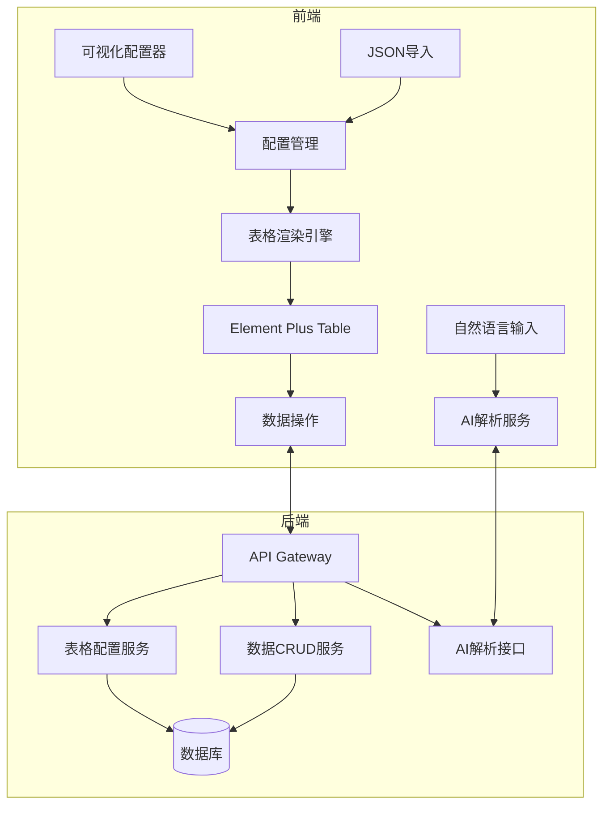

## 产品概述

一个智能动态表格系统，支持用户通过多种方式（自然语言、可视化配置、JSON导入）快速创建定制化的Web表格，提供完整的数据管理能力和AI辅助功能。

## 核心功能

### 表格创建方式

- **自然语言创建**：用户输入"创建一个员工管理表，包含姓名、工号、部门、入职日期"等描述，AI自动生成表格结构
- **可视化配置**：拖拽式界面，支持添加/删除列、设置字段类型（文本/数字/日期/下拉框等）、配置校验规则
- **JSON/配置导入**：支持JSON配置文件快速导入，批量创建复杂表格结构

### 表格功能

- **数据展示**：响应式表格布局，自适应屏幕
- **增删改查**：新增行、删除行、编辑单元格、数据查询
- **排序筛选**：多列排序、条件筛选、高级搜索
- **分页功能**：前后端分页支持
- **单元格编辑**：双击编辑、批量编辑、撤销重做
- **行列拖拽**：拖拽调整列宽、行排序、列顺序调整

### 数据管理

- **数据持久化**：所有表格配置和数据存储到数据库
- **导入导出**：支持Excel/CSV导入导出
- **数据备份**：表格数据导出备份功能

## 技术栈选择

- **前端框架**：Vue 3 + TypeScript + Vite
- **UI组件库**：Element Plus（成熟的表格组件，支持排序、筛选、编辑、虚拟滚动）
- **表格增强**：vuedraggable（拖拽功能）、xlsx（Excel处理）
- **后端框架**：Node.js + Express + TypeScript
- **数据库**：SQLite（开发）/ MySQL（生产）+ Prisma ORM
- **AI集成**：支持调用大模型API解析自然语言

## 技术架构

### 系统架构图



### 模块划分

#### 前端模块

- **views/table/**：表格展示与交互页面
- **views/config/**：可视化配置器页面
- **components/TableBuilder/**：表格构建器组件
- **components/FieldConfig/**：字段配置组件
- **components/AIInput/**：自然语言输入组件
- **stores/table.ts**：表格状态管理
- **api/table.ts**：表格API封装

#### 后端模块

- **routes/table.ts**：表格配置路由
- **routes/data.ts**：数据CRUD路由
- **routes/ai.ts**：AI解析路由
- **services/tableService.ts**：表格配置服务
- **services/dataService.ts**：动态数据服务
- **services/aiService.ts**：AI解析服务
- **prisma/schema.prisma**：数据库模型

### 数据库设计

- **TableConfig表**：存储表格配置（id, name, config JSON, createdAt）
- **TableField表**：存储字段定义（id, tableId, name, type, config JSON）
- **DynamicData表**：动态存储表格数据（id, tableId, rowData JSON）

## 目录结构

```
d:/code/
├── frontend/                          # 前端项目
│   ├── src/
│   │   ├── views/
│   │   │   ├── home/                  # [NEW] 首页，表格列表入口
│   │   │   ├── table/                 # [NEW] 表格展示页面
│   │   │   │   └── TableView.vue      # 表格渲染、CRUD、排序筛选分页、拖拽
│   │   │   └── config/                # [NEW] 表格配置页面
│   │   │       └── TableConfig.vue    # 可视化配置器、字段定义、校验规则
│   │   ├── components/
│   │   │   ├── TableBuilder/          # [NEW] 表格构建器组件
│   │   │   │   └── index.vue          # 动态表格渲染引擎核心组件
│   │   │   ├── FieldConfig/           # [NEW] 字段配置组件
│   │   │   │   └── index.vue          # 字段类型选择、属性配置面板
│   │   │   ├── AIInput/               # [NEW] 自然语言输入组件
│   │   │   │   └── index.vue          # AI输入框、解析结果预览
│   │   │   └── JsonImport/            # [NEW] JSON导入组件
│   │   │       └── index.vue          # JSON上传、解析、预览
│   │   ├── api/
│   │   │   └── table.ts               # [NEW] 表格相关API封装
│   │   ├── stores/
│   │   │   └── table.ts               # [NEW] Pinia状态管理
│   │   ├── types/
│   │   │   └── table.ts               # [NEW] TypeScript类型定义
│   │   └── utils/
│   │       └── excel.ts               # [NEW] Excel导入导出工具
│   └── package.json
│
├── backend/                           # 后端项目
│   ├── src/
│   │   ├── routes/
│   │   │   ├── table.ts               # [NEW] 表格配置路由
│   │   │   ├── data.ts                # [NEW] 数据CRUD路由
│   │   │   └── ai.ts                  # [NEW] AI解析路由
│   │   ├── services/
│   │   │   ├── tableService.ts        # [NEW] 表格配置服务
│   │   │   ├── dataService.ts         # [NEW] 动态数据服务
│   │   │   └── aiService.ts           # [NEW] AI解析服务
│   │   ├── middleware/
│   │   │   └── errorHandler.ts        # [NEW] 错误处理中间件
│   │   └── app.ts                     # [NEW] Express应用入口
│   ├── prisma/
│   │   └── schema.prisma              # [NEW] 数据库模型定义
│   └── package.json
│
└── README.md                          # [NEW] 项目说明文档
```

## 实现要点

### 动态表格核心设计

- 使用JSON Schema定义表格结构，包含字段名、类型、校验规则、显示配置
- 前端根据Schema动态渲染表格列，Element Plus Table支持动态columns
- 后端使用动态SQL构建，根据tableId查询对应数据表

### AI自然语言解析

- 设计Prompt模板，将用户输入转换为标准JSON Schema
- 支持识别常见字段类型：文本、数字、日期、邮箱、手机号、下拉选择
- 解析失败时提供友好提示，引导用户使用可视化配置

### 性能优化

- 大数据量使用虚拟滚动（Element Plus Table内置支持）
- 后端分页查询，避免全量数据传输
- 表格配置缓存到前端localStorage，减少API请求

## 设计风格

采用现代企业级设计风格，简洁专业的界面风格。使用TDesign组件库，配合柔和的蓝色主色调，营造高效、专业的操作体验。

## 页面规划

### 1. 首页（表格列表）

- **顶部导航栏**：Logo、搜索框、新建表格按钮、用户头像
- **快速创建区**：AI输入框（自然语言创建）、模板选择、JSON导入入口
- **表格列表区**：卡片式展示已创建的表格，支持搜索筛选
- **底部导航**：首页、我的表格、模板中心、设置

### 2. 表格配置页

- **左侧字段面板**：字段列表、添加字段按钮、字段类型选择
- **中间预览区**：实时预览表格效果
- **右侧属性面板**：选中字段的详细配置（类型、校验、默认值）
- **顶部操作栏**：保存、预览、发布、导入导出

### 3. 表格展示页

- **工具栏**：新增、删除、导入、导出、筛选、列设置
- **表格主体**：数据展示、排序、编辑、拖拽
- **底部分页**：页码、每页条数、总数统计

### 4. AI创建页

- **AI输入区**：大文本框，提示示例
- **解析结果预览**：显示识别出的字段结构
- **确认创建按钮**：确认后跳转表格页